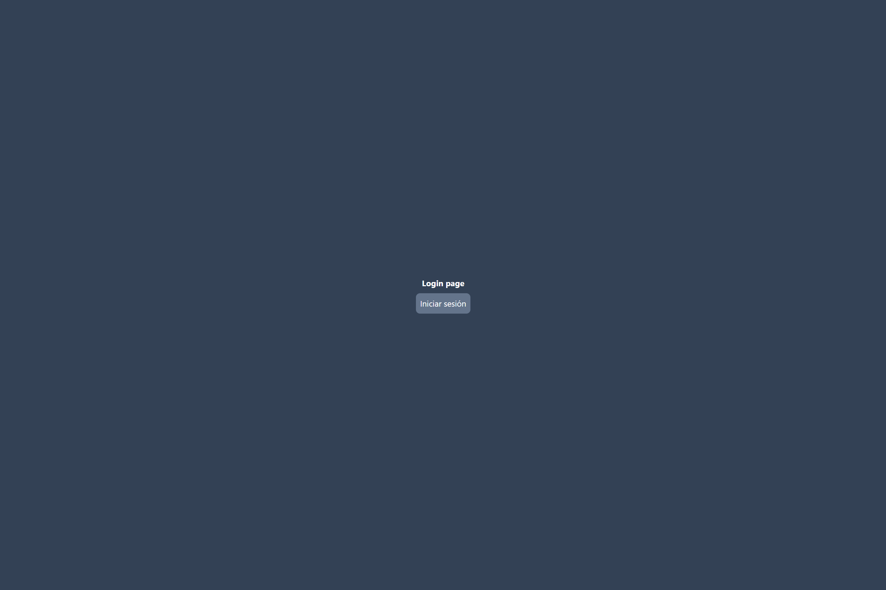
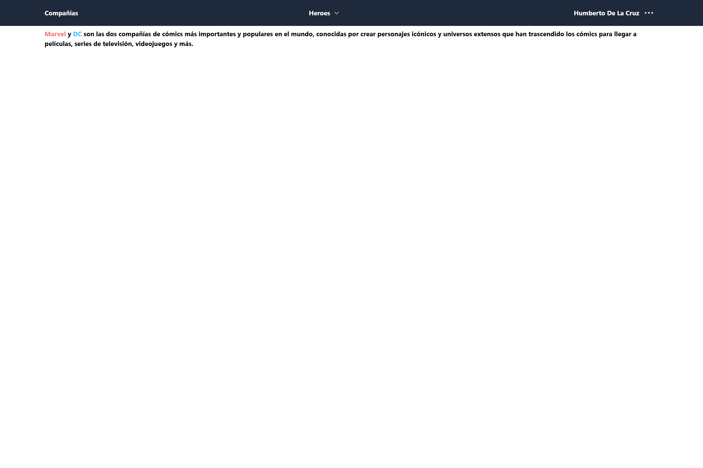
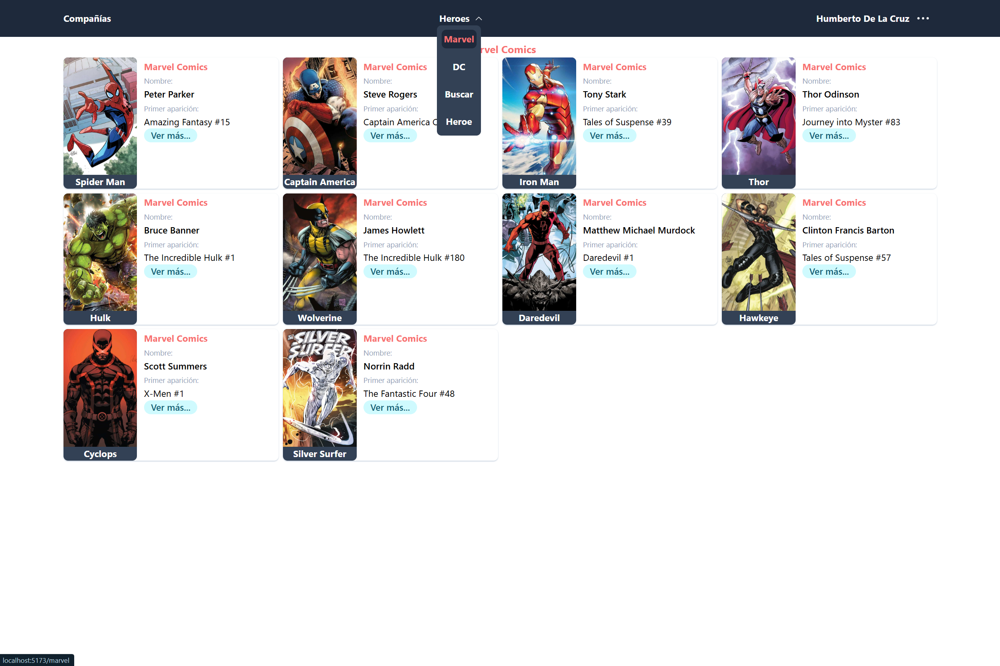
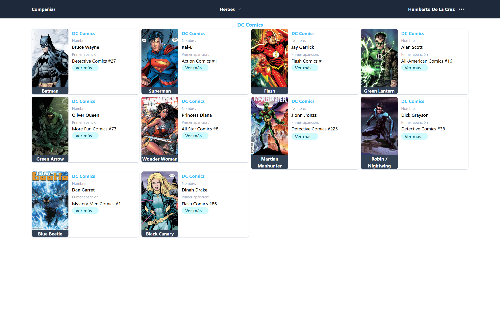
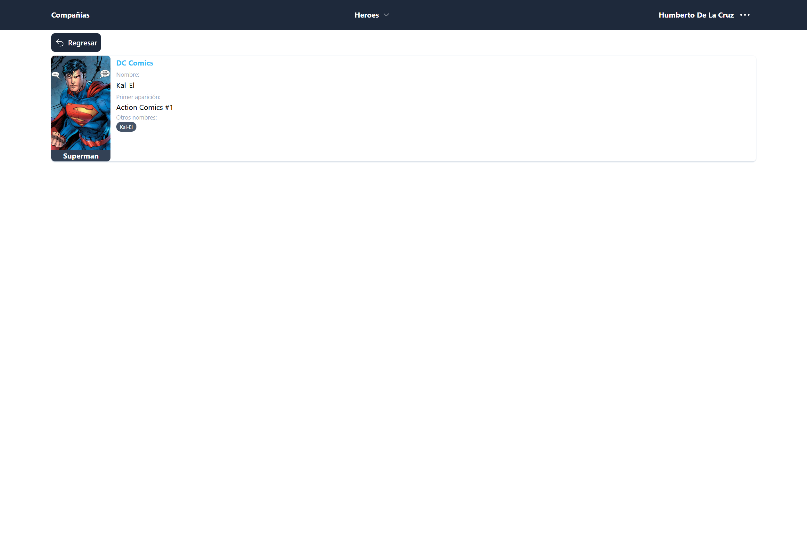
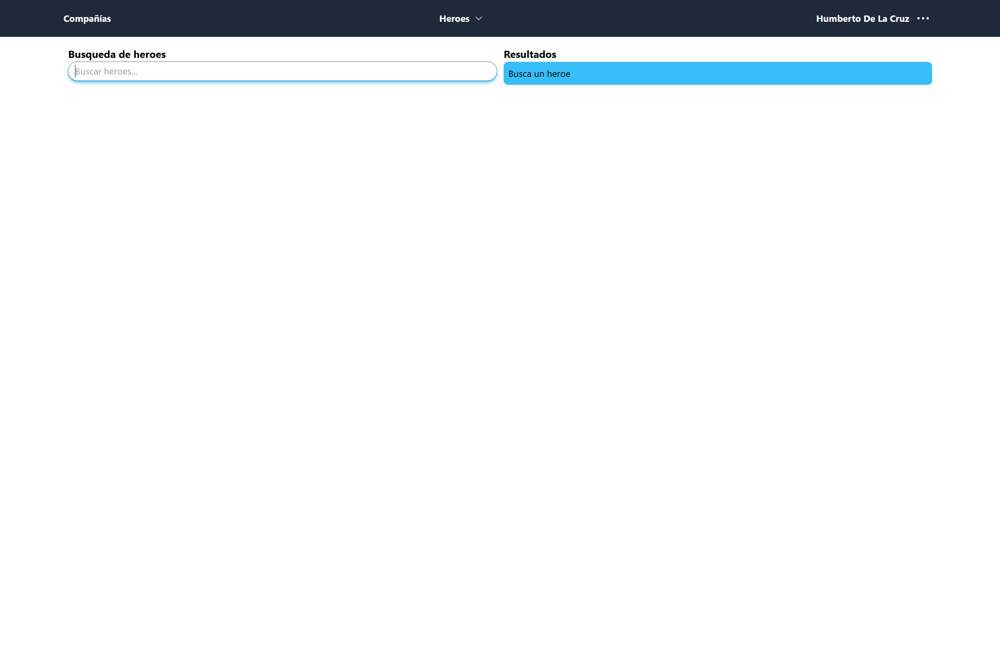
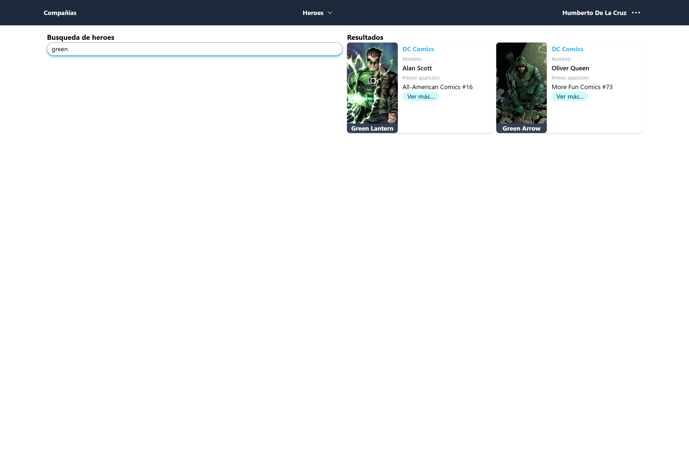

# Heroes App 🚀

Aplicación de heroes Marvel y DC desarrollada en React JS con Tailwind CSS, en esta app aprendí a utilizar algunos de los custom hooks de la librería de React Router DOM.

Características
- Simulación de login desde frontend (aún no tiene una comunicación con backend)
- Uso de Context API y Reducer para el información de login
- Uso de rutas publicas y privadas
- Recuerda la ultima ruta a la que se accedió antes de cerrar sesión

Resultados:

Login

Inicio / Home

Marvel

DC

Ver más detalles de un heroe

Buscar heroe

>[!IMPORTANT]
>El despligue con github pages tiene errores por cuestiones de rutas propias de github
